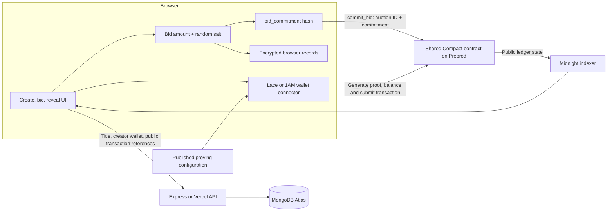
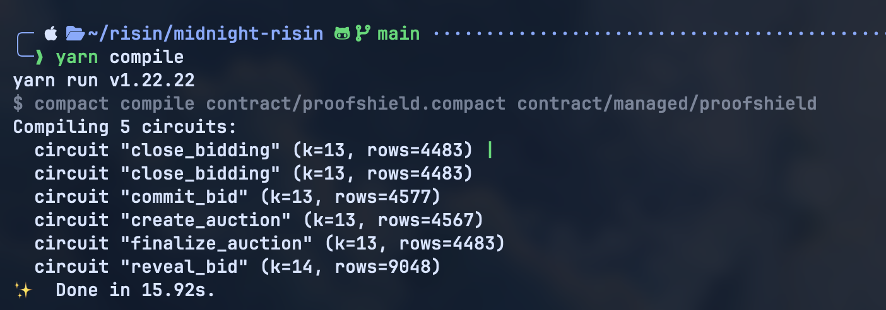
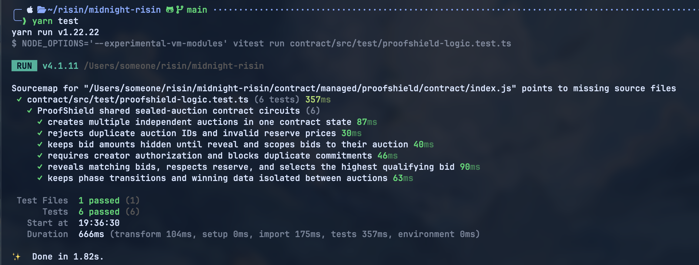

# ProofXShield

> Sealed-bid auctions on Midnight — bids stay hidden until the reveal phase, then get verified against an on-chain shared contract.

---

## Contents

- [What is this?](#what-is-this)
- [How it works](#how-it-works)
- [Privacy model](#privacy-model)
- [Features](#features)
- [Tech stack](#tech-stack)
- [Getting started](#getting-started)
- [Running tests](#running-tests)
- [Deploying](#deploying)
- [Screenshots](#screenshots)
- [Project layout](#project-layout)
- [Further reading](#further-reading)

---

<a id="what-is-this"></a>
## What is this?

ProofXShield is a commit-and-reveal auction dApp built on the Midnight blockchain. While an auction is open, bidders submit only a cryptographic commitment — a hash derived from their bid amount and a random salt. Once the auction creator closes bidding, participants can reveal their actual bids. The on-chain contract then checks each revealed value against its earlier commitment and determines the highest qualifying bid above the reserve.

All auctions share a **single deployed contract**. Creating a new auction registers a new ID inside that contract rather than deploying a fresh one each time.

**Quick example:** Say the reserve is 10. A bidder picks 15 and generates a random salt. During the bidding phase, the contract only sees the hash — not the 15. After bidding closes, the bidder submits 15 and the salt. The contract confirms they match and records 15 as the revealed amount.

> **Note:** This is a prototype. It does not verify off-chain credentials, escrow funds, or transfer payments.

---

## Why the problem matters

In a normal open auction, later bidders can see what others have already bid. That leaks information about willingness to pay and distorts strategy. ProofXShield keeps bid amounts hidden during the active bidding period, only making them visible once everyone has committed — giving each participant a fair shot without exposing their hand early.

### Why Midnight?

Midnight's Compact language lets you define precise on-chain rules for state transitions. When a wallet submits a transaction, Midnight's proof system verifies the call satisfies those rules before the network applies the state change.

In ProofXShield, the sealed-bid property comes from the commit-and-reveal protocol itself: the contract stores hashes during bidding, not amounts. The ZK proof system then enforces rules like "this reveal matches a previously submitted commitment" and "only the auction creator can close bidding." Revealing a bid is intentional and public — this is not a credential prover.

---

<a id="how-it-works"></a>
## How it works



**Step by step:**

| Step | Actor | What happens |
|------|-------|-------------|
| **1. Create** | Auction creator | Connects wallet, picks a title and reserve, registers an auction ID in the shared Preprod contract. Creator secret is encrypted in browser storage; the title and transaction reference go to the catalogue API. |
| **2. Commit** | Bidder | Enters a whole-number bid amount. The browser generates a random 32-byte salt, computes `bid_commitment(amount, salt)`, saves both locally, and sends only the auction ID + commitment to `commit_bid`. |
| **3. Close** | Creator | Calls `close_bidding` with their secret. Contract verifies it against the stored owner commitment and transitions the auction to the reveal phase. |
| **4. Reveal** | Bidder | Calls `reveal_bid` with the saved amount and salt. Contract checks the commitment, records the amount, and updates the highest qualifying bid if the reserve is met. |
| **5. Finalize** | Creator | Calls `finalize_auction`. The result becomes readable in public contract state. |

The browser pulls the proving configuration from the app's static artifacts, then delegates proof creation to the connected wallet's Midnight dApp Connector. MongoDB stores the catalogue, accounts, wallet links, and activity references — it is not the source of truth for auction state; that lives on-chain.

---

<a id="privacy-model"></a>
## Privacy model

| What | How it is handled |
|------|-----------------|
| Bid amount + salt | Generated and encrypted in the browser. Only the hash goes on-chain during `commit_bid`. The amount is intentionally disclosed on-chain during `reveal_bid`; the salt is never stored as a ledger field. |
| `owner_secret` | Used by `create_auction`, `close_bidding`, and `finalize_auction` to check the owner commitment. Never written to the ledger; lives in this browser only. |
| Public on-chain state | Auction ID, reserve, current phase, commitment hashes, commitment/reveal counts, revealed amounts, highest qualifying bid, winning commitment, transaction references. |
| What MongoDB holds | Catalogue title, creator wallet label, account data, linked wallets, activity log. |
| What the contract enforces | Positive reserve, unique auction IDs, phase ordering, no duplicate commitments, creator-secret authorization, reveal-matches-commitment, reserve and highest-bid tracking. |
| What a network observer learns | During bidding: only the commitment hash. After reveal: the amount and updated auction state. The network verifies circuit rules but cannot un-hash an unrevealed commitment. |
| Limitations | Browser data is lost if local storage is cleared (no cloud backup). Encryption derives its key from material also in local storage — not hardware-backed. The contract does not force bidders to reveal or hold funds. |

> Commitments are only as private as the browser keeping them. A compromised browser or leaked local storage can expose records before they are voluntarily revealed.

---

<a id="features"></a>
## Features

**Core contract**

- Five Compact circuits in one shared contract: `create_auction`, `commit_bid`, `close_bidding`, `reveal_bid`, `finalize_auction`
- Enforces positive reserves, unique IDs, phase rules, creator authorization, commitment uniqueness, and reserve-based highest-bid selection

**Application**

- Full auction lifecycle in the browser: create, browse, commit, close, reveal, finalize
- Catalogue backed by MongoDB; auction state read from Midnight Preprod indexer
- Lace and 1AM wallet support via the Midnight dApp Connector
- Bid data and creator secrets stay in encrypted browser storage — never sent to the API
- Better Auth handles accounts (email/password built-in; Google OAuth optional)
- Compiled ZK artifacts copied into the static build for browser-side proof generation

**Prototype boundaries**

- Targets Midnight Preprod only; the wallet must be connected to Preprod
- Google sign-in requires configuring OAuth credentials separately
- Clearing browser local storage removes access to creator-only actions and unrevealed bids
- No fund escrow, payment transfer, time-based deadlines, or credential verification
- No standalone ZK proof inspector or verifier portal

---

<a id="tech-stack"></a>
## Tech stack

| Layer | Technology |
|-------|-----------|
| Smart contract | Midnight Compact — `contract/proofxshield.compact` |
| Midnight integration | Midnight JS, Wallet SDK, dApp Connector API |
| Frontend | Static HTML/CSS/JS bundled with Vite (React tooling installed, pages are not a React app) |
| Server / API | Node.js 22+, Express (local), Vercel serverless routes |
| Auth & data | Better Auth, MongoDB driver |
| Proof generation | Wallet dApp Connector provider (browser); HTTP proof provider (Node / deployment) |
| Local proof service | Midnight proof server 8.1.0 via `compose.yml` |
| Tests | Vitest, Midnight Testkit |
| Package manager | Yarn Classic 1.22.22 |

Compact `language_version 0.23` is used; Compact CLI **0.31.1** is required. Node.js **22 or newer** is required.

---

<a id="getting-started"></a>
## Getting started

### Prerequisites

- Node.js >= 22 and Yarn 1.22.x
- Compact CLI 0.31.1
- MongoDB Atlas connection string
- Lace or 1AM wallet configured on Midnight Preprod
- Google OAuth credentials *(only needed for Google sign-in)*
- Docker Compose + local Midnight node and indexer *(only needed for local integration tests)*

### Install

```bash
git clone https://github.com/Win-APEX/ShieldXProof.git
cd proofxshield
yarn install --frozen-lockfile
cp .env.example .env
```

Open `.env` and fill in:

- `MONGODB_URI` — a valid Atlas connection string (required, even locally)
- `MONGODB_DB_NAME` — defaults to `proofxshield`
- `BETTER_AUTH_SECRET` — random string, at least 32 characters
- `GOOGLE_CLIENT_ID` / `GOOGLE_CLIENT_SECRET` — only if enabling Google sign-in; set the OAuth callback to `http://localhost:3000/api/auth/callback/google`

### Build

```bash
yarn compile
yarn build
```

`yarn compile` regenerates the `contract/managed/proofxshield` artifacts and ZK proving files. `yarn build` bundles the frontend and copies those artifacts into `public/contract/managed/`.

### Run locally

```bash
yarn server
```

Open [http://localhost:3000](http://localhost:3000). For hot reload during development, run `yarn server` and `yarn dev` in parallel, then open [http://localhost:5173](http://localhost:5173) — Vite proxies `/api` to port 3000.

### Local proof services

```bash
yarn proof:up    # starts Midnight proof server on 127.0.0.1:6300
yarn proof:down  # stops it
```

For local integration tests you also need a Midnight node on `127.0.0.1:9944` and an indexer on `127.0.0.1:8088`. Network endpoints live in [`contract/src/config.ts`](./contract/src/config.ts).

---

<a id="running-tests"></a>
## Running tests

**Contract logic (in-process, no network):**

```bash
yarn test
```

Runs `contract/src/test/proofxshield-logic.test.ts` — **6 tests** covering: multiple auctions in one state, duplicate ID and reserve handling, hidden amounts before reveal, creator authorization, commitment validation, reserve and highest-bid selection, independent auction phases.

**Network integration (submits real transactions):**

```bash
yarn test:integration    # local network (default)
yarn test:preprod        # Midnight Preprod — requires funded wallet + MIDNIGHT_PREPROD_MNEMONIC or MIDNIGHT_PREPROD_SEED
yarn test:preview        # Midnight Preview — requires funded wallet + MIDNIGHT_PREVIEW_MNEMONIC or MIDNIGHT_PREVIEW_SEED
```

> Network tests submit actual transactions and may incur fees.

---

<a id="deploying"></a>
## Deploying

### Contract address

The app is configured for Midnight Preprod. The shared contract address is set in [`contract-address.js`](./contract-address.js):

| Network | Contract address |
|---------|-----------------|
| Midnight Preprod | `b0bd1feb64dadad51e987f6ba8e08adaa26945b3135b44c014c8f08a56bbae89` |

*See [`public/mid_explorer.png`](./public/mid_explorer.png) for a Midnight Explorer capture of this deployment.*

### Re-deploying the contract

```bash
yarn deploy
```

Set `MIDNIGHT_NETWORK=preview` or `preprod` and provide exactly one of the matching mnemonic/seed env vars in `.env.preview` or `.env.preprod`. Never commit those files. The script writes a local `deployment.json` but does **not** automatically update `contract-address.js` — do that manually after confirming the deployment.

### Hosting

The app is hosted at [shield-x-proof.vercel.app](https://shield-x-proof.vercel.app/). Vercel runs `yarn install --frozen-lockfile` and `yarn build`, serves `dist/` statically, and exposes the `api/` routes as serverless functions. MongoDB and Better Auth environment variables must be configured in the Vercel project settings.

---

<a id="screenshots"></a>
## Screenshots

### Contract compilation



*`yarn compile` output — all circuits compiled successfully.*

### Logic test run



*`yarn test` output — 6 tests passed.*

### Preprod deployment


*Midnight Explorer capture of the contract address on Preprod, showing the `finalize_auction` entry point and ledger state.*

---

<a id="project-layout"></a>
## Project layout

```text
proofxshield/
├── api/                 # Vercel serverless API routes
├── assets/              # ProofXShield logo and hero artwork
├── contract/
│   ├── managed/         # Generated Compact bindings, ZK keys, and proving artifacts
│   ├── src/             # Network providers, wallet setup, and tests
│   └── proofxshield.compact
├── public/              # Static assets and compiled browser proof artifacts
├── scripts/             # Build-time artifact helpers
├── server/              # Express server, auth, catalogue, and activity handlers
├── *.html, *.js, *.css  # Browser application pages
├── compose.yml          # Local proof server (Docker Compose)
└── package.json         # Scripts and dependencies
```

---

<a id="further-reading"></a>
## Further reading

- [Smart contract source](./contract/proofxshield.compact)
- [Browser proof-provider integration](./proof-client.js)
- [Network endpoint config](./contract/src/config.ts)
- [Node provider setup for tests and deployment](./contract/src/providers.ts)
- [Contract logic test suite](./contract/src/test/proofxshield-logic.test.ts)
- [Network integration test](./contract/src/test/proofxshield.test.ts)
- [Environment variable reference](./.env.example)

---

## License

No `LICENSE` file is present in this repository.
